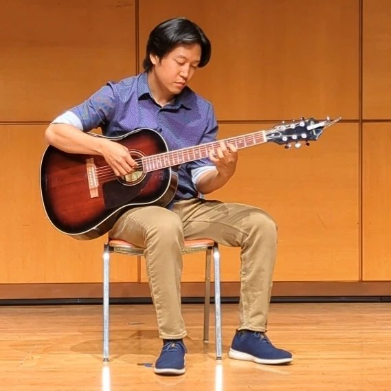

# About Me

<figure markdown="span">
{ width="80%" style="max-width:500px;" }
<figcaption></figcaption>
</figure>

:material-home: I am a long-time Cleveland resident and have earned all of my secondary education in the state of Ohio (Kent State University, Cleveland State University, and now Case Western Reserve University). I also attended middle and high school in the Cleveland suburbs.

:material-guitar-acoustic: Music is my main hobby. My main instrument is acoustic steel guitar, but I also enjoy playing keyboard and singing. I also like to write my own music, especially composition and arrangement. I have a special interest in applying AI/ML to music, specifically sound modeling, low-latency networks, and music theory.

🇰🇷 My Korean name is 유서환 (유=Yu, 서=Seo, 환=Hwan). I can speak Korean fluently and write at an elementary school level.

