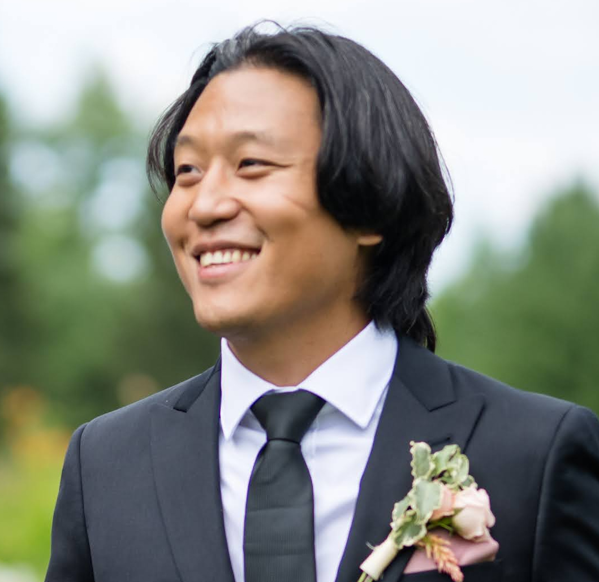

# Andrew Seohwan Yu

<figure markdown="span">
{ width="80%" style="max-width:300px;" }
<figcaption></figcaption>
</figure>

:material-school: **Computer Science PhD Candidate (Dec. 2026)** @ Case Western Reserve University
 :material-briefcase: **Researcher** @ Cleveland Clinic Research
 :material-lightbulb: **Working on** Multimodal AI (3D medical images, vision, text, audio)
 :material-magnify: **Looking for** machine learning career opportunities and research collaborations
 :material-map-marker: Cleveland, OH, USA (US-born citizen)
 :material-file-document: [Download CV (PDF)](assets/cv_2026_02.pdf)

---

## Education

**PhD in Computer Science** 
 Case Western Reserve University (2021~Expected Graduation Dec. 2026)

* Advisor: [Dr. Vipin Chaudhary](https://case.edu/engineering/about/faculty-and-staff-directory/vipin-chaudhary)
    * *Qualifying Exam: Evaluation of Image Generative Models*
    * Prompt engineering and optimization, and fine-tuning for narrow applications
    * Anomaly detection: grounded distribution representation via embedding typicality

**MS in Computer Science**
 Cleveland State University (2014~2017)

* Advisor: [Dr. Sunnie Sun Chung](https://eecs.csuohio.edu/~sschung/)
    * *Thesis: NBA On-Ball Screens: Automatic Identification and Analysis of Basketball Plays*
    * Big / streaming data analytics
    * Sports analytics

---

## Experience

**Graduate Research Assistant**
 Cleveland Clinic Lerner Research Institute (2021~Present)

* Development of radiology report generation system
* Interdisciplinary work with radiologists and MRI physicists
* MLOps for medical image classification, segmentation models

**Instructor**
 Penn State University (2017~2021)

* Full-time instruction of undergraduate computer science courses
    * Introduction to Programming (C++)
    * Operating Systems (C, UNIX)
    * Mobile Applications (Android, Kotlin)
    * Technical Game Development (Unreal Engine)
    * Artificial Intelligence (Python)
* End-to-end development of online computer science courses
