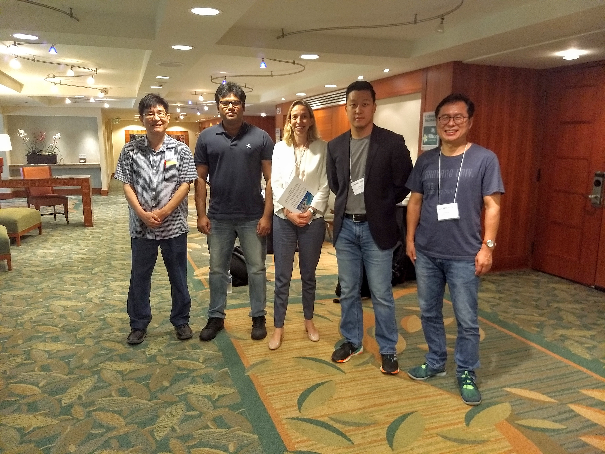

# Publications

<figure markdown="span">
{ width="80%" style="max-width:800;" }
<figcaption></figcaption>
</figure>

**Novel adaptation of video segmentation to 3D MRI: efficient zero-shot knee segmentation with SAM2**
Andrew Seohwan Yu, Mohsen Hariri, Xuecen Zhang, Mingrui Yang, Vipin Chaudhary, Xiaojuan Li
*arXiv preprint arXiv:2408.04762*, 2024
[:material-file-pdf-box: PDF](https://arxiv.org/pdf/2408.04762) · [:material-link: DOI](https://doi.org/10.1117/12.3047346)

---

**Unsupervised Segmentation of Knee Bone Marrow Edema-like Lesions Using Conditional Generative Models**
Andrew Seohwan Yu, Mingrui Yang, Richard Lartey, William Holden, Ahmet Hakan Ok, Sameed Khan, Jeehun Kim, Carl Winalski, Naveen Subhas, Vipin Chaudhary, Xiaojuan Li
*Bioengineering*, 11(6), 526, 2024

---

**Inpainting MRI for unsupervised knee bone marrow edema-like lesion segmentation using conditional diffusion models**
Andrew Seohwan Yu, Richard Lartey, William Holden, Ahmet Hakan Ok, Jeehun Kim, Carl Winalski, Naveen Subhas, Vipin Chaudhary, Xiaojuan Li
*Medical Imaging 2024: Imaging Informatics for Healthcare, Research, and Applications*, SPIE, 2024

---

**Forte: Finding Outliers with Representation Typicality Estimation**
Debargha Ganguly, Warren Morningstar, Andrew Yu, Vipin Chaudhary
*arXiv preprint arXiv:2410.01322*, 2024

---

**Novel Unsupervised Segmentation of Bone Marrow Edema-Like Lesions using Bayesian Conditional Generative Adversarial Networks**
Andrew Seohwan Yu, Sibaji Gaj, William Holden, Richard Lartey, Jeehun Kim, Carl Winalski, Naveen Subhas, Xiaojuan Li

---

**Framework for analysis and prediction of NBA basketball plays: On-ball screens**
Andrew Yu, Sunnie Chung
*IEEE SmartWorld/SCALCOM/UIC/ATC/CBDCom/IOP/SCI*, 2019

---

**Automatic identification and analysis of basketball plays: NBA on-ball screens**
Andrew Yu, Sun Sunnie Chung
*IEEE International Conference on Big Data, Cloud Computing, Data Science & Engineering (BCD)*, 2019

---

**NBA On-Ball Screens: Automatic Identification and Analysis of Basketball Plays**
Andrew Seohwan Yu
*Master's Thesis*, Cleveland State University, 2017
