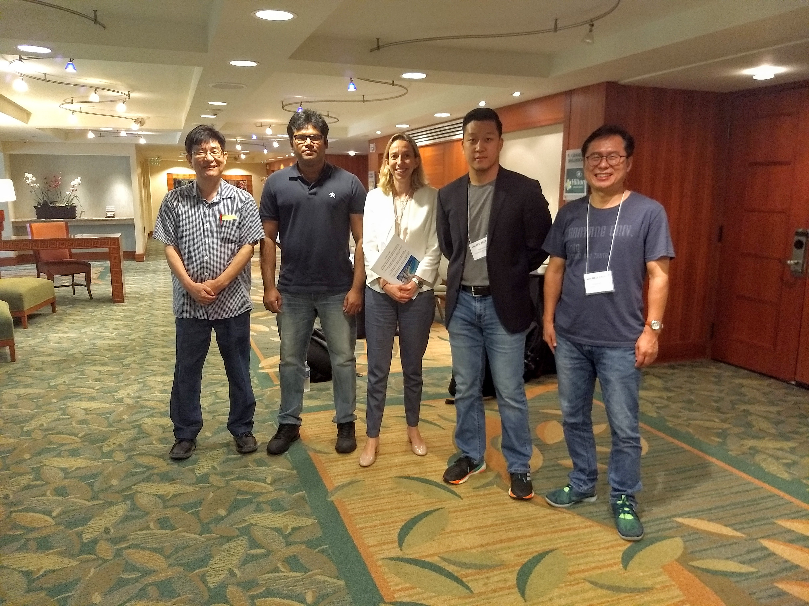

# Publications

<figure markdown="span">
{ width="80%" style="max-width:800;" }
<figcaption></figcaption>
</figure>

[2026] **Medical Image Spatial Grounding with Semantic Sampling**
Andrew Seohwan Yu, Mohsen Hariri, Kunio Nakamura, Mingrui Yang, Xiaojuan Li, Vipin Chaudhary
*MICCAI (Medical Image Computing and Computer Assisted Intervention)*
[:material-link: arXiv](https://arxiv.org/abs/2603.14579)

---

[2026] **Multi-label Ensemble Model for Knee Joint Anatomy and Lesion Segmentation: Segmentation of Clinical Images With Ensembling, Morphology, and Attention (SCEMA)**
Andrew Seohwan Yu, Mingrui Yang, Kunio Nakamura, Richard Lartey, Sercan Tosun, Naveen Subhas, Carl Winalski, Vipin Chaudhary, Xiaojuan Li
*MRM (Magnetic Resonance in Imaging)*
[:material-link: DOI](https://doi.org/10.1002/mrm.70365)

---

[2025] **Novel adaptation of video segmentation to 3D MRI: efficient zero-shot knee segmentation with SAM2**
Andrew Seohwan Yu, Mohsen Hariri, Xuecen Zhang, Mingrui Yang, Vipin Chaudhary, Xiaojuan Li
*SPIE (The International Cociety for Optics and Photonics)*
[:material-file-pdf-box: PDF](https://arxiv.org/pdf/2408.04762) · [:material-link: DOI](https://doi.org/10.1117/12.3047346)

---

[2024] **Unsupervised Segmentation of Knee Bone Marrow Edema-like Lesions Using Conditional Generative Models**
Andrew Seohwan Yu, Mingrui Yang, Richard Lartey, William Holden, Ahmet Hakan Ok, Sameed Khan, Jeehun Kim, Carl Winalski, Naveen Subhas, Vipin Chaudhary, Xiaojuan Li
*Bioengineering*, 11(6), 526

---

[2024] **Inpainting MRI for unsupervised knee bone marrow edema-like lesion segmentation using conditional diffusion models**
Andrew Seohwan Yu, Richard Lartey, William Holden, Ahmet Hakan Ok, Jeehun Kim, Carl Winalski, Naveen Subhas, Vipin Chaudhary, Xiaojuan Li
*SPIE (The International Cociety for Optics and Photonics)*,  

---

[2024] **Forte: Finding Outliers with Representation Typicality Estimation**
Debargha Ganguly, Warren Morningstar, Andrew Yu, Vipin Chaudhary
*ICLR (International Conference on Learning Representations)*

---

[2023] **Novel Unsupervised Segmentation of Bone Marrow Edema-Like Lesions using Bayesian Conditional Generative Adversarial Networks**
Andrew Seohwan Yu, Sibaji Gaj, William Holden, Richard Lartey, Jeehun Kim, Carl Winalski, Naveen Subhas, Xiaojuan Li
*ISMRM (The International Society for Magnetic Resonance in Medicine<)*
---

[2019] **Framework for analysis and prediction of NBA basketball plays: On-ball screens**
Andrew Yu, Sunnie Chung
*IEEE SmartWorld/SCALCOM/UIC/ATC/CBDCom/IOP/SCI*

---

[2019] **Automatic identification and analysis of basketball plays: NBA on-ball screens**
Andrew Yu, Sun Sunnie Chung
*IEEE International Conference on Big Data, Cloud Computing, Data Science & Engineering (BCD)*

---

[2017] **NBA On-Ball Screens: Automatic Identification and Analysis of Basketball Plays**
Andrew Seohwan Yu
*Master's Thesis*, Cleveland State University
